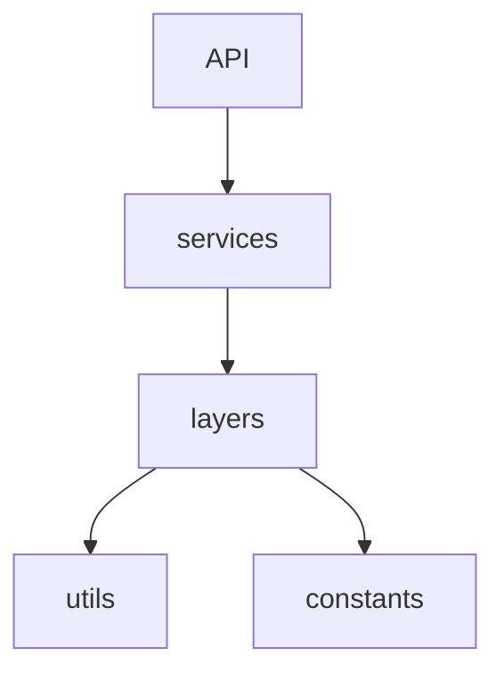

# Phase 2: Domain Architecture Correction Report

## 1. Domain Logic Leaks Detected

| File                                | Issue               | Type         |
| ----------------------------------- | ------------------- | ------------ |
| `services/grading/score_validator.py` | score clamping rule | domain logic |

---

## 2. Logic Moved to Layers

| Source File                         | Destination File           | Function    |
| ----------------------------------- | -------------------------- | ----------- |
| `services/grading/score_validator.py` | `layers/universal/grader.py` | `ScoreValidator` (class containing `validate`) |

---

## 3. Services Updated

The following service modules were modified to call the domain layer rather than implementing business rules internally:

* `app/services/grading/score_validator.py` (Delegates validation to `app.layers.universal.grader.ScoreValidator`)

---

## 4. Dependency Validation

Confirmed that the `layers` module does not import from forbidden upper modules.

```bash
# Executed equivalent search:
grep -r "from app.services" app/layers
grep -r "from app.adapters" app/layers
grep -r "from app.infrastructure" app/layers
```

**Result:**
```
0 matches
```

---

## 5. Final Dependency Architecture

The dependency flow now strictly follows Clean Architecture principles:



Expected rules confirmed:
* `services` → `layers`
* `layers` → `utils`
* `layers` → `constants`
* **No reverse dependency exists** (e.g. `layers` does not depend on `services` or `adapters`).

---

## 6. Expected Outcome Reached

✔ All business rules exist inside `app/layers`
✔ Services only orchestrate workflows
✔ Domain layer is independent from services
✔ Clean Architecture dependency direction is enforced
