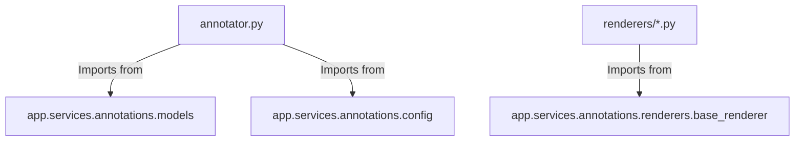

# Refactor Audit Report — Annotations System (Phase 4)

## 1. Architecture Overview

The annotations system has been partially transitioned from a monolithic file to a modular package structure. However, the system currently exists in a hybrid and non-functional state.

### Current Structure
```
app/services/
├── annotation.py (Monolith - 1130 lines)
└── annotation_v2/ (Modular Folder)
    ├── annotator.py (Orchestrator)
    ├── fallback.py (Fallback logic)
    ├── models.py (Models/Exports)
    ├── utils.py (Geometric utilities)
    └── renderers/ (Specific annotation types)
        ├── box.py
        ├── comment.py
        ├── score.py
        ├── tick_cross.py
        └── underline.py
```

### Roles and Dependencies
- **Monolith (`annotation.py`)**: Acts as the active service. It contains all logic for basic and Vision-OCR based annotations. It depends on `app.utils.annotation_utils` (which appears to have been renamed to `app.utils.annotations`).
- **Orchestrator (`annotator.py`)**: Intended to be the new entry point. It delegates rendering to specific renderer classes.
- **Renderers**: Modular classes responsible for specific annotation types (e.g., `UnderlineRenderer`, `ScoreRenderer`).

### Industry Standard Compliance
The modular structure (`annotation_v2`) correctly follows industry patterns (Strategy Pattern for renderers, Orchestrator for workflow). However, the implementation is **broken** due to missing files and incorrect import paths.

---

## 2. Backward Compatibility Verification

The system is currently defaulting to the monolithic file. The modular version is not integrated into the main pipeline.

| File | Status | Notes |
| :--- | :--- | :--- |
| `annotation.py` | **Contains All Business Logic** | This is the file currently imported by `grading` and `routes`. |
| `annotation_v2/` | **Inactive / Broken** | Contains modular logic but is not used and cannot run due to missing dependencies. |

**Verdict**: Refactor Incomplete / Broken.

---

## 3. Duplicate Logic Detection

Significant duplication exists between the monolith and the modular system.

| Duplicate Code | Old Location (`annotation.py`) | New Location (`annotation_v2/`) | Severity |
| :--- | :--- | :--- | :--- |
| **Coordinate Clipping** | Multiple lines in `generate_annotated_images` | `utils.py` | Medium |
| **Logic for Ticks/Crosses** | Lines 673-696, 769-825 | `renderers/tick_cross.py` | High |
| **Score Placement Logic** | Lines 974-1120 | `annotator.py` + `renderers/score.py` | High |
| **Fallback Logic** | Lines 900-971 | `fallback.py` | High |

---

## 4. Dead Code Detection

| File | Function | Reason |
| :--- | :--- | :--- |
| `annotation.py` | `_generate_margin_annotations` | Appears to be a legacy fallback that is rarely if ever reached in Phase 4. |
| `annotation.py` | `generate_annotated_images` | Basic version often bypassed by the async `with_vision_ocr` version. |
| `annotation_v2` | All files | Currently constitutes "Dead Code" since the module is not imported by any active service. |

---

## 5. Feature Migration Verification

| Feature | Exists in Monolith | Exists in Modular System | Status |
| :--- | :--- | :--- | :--- |
| `line_id` placement | Yes | Yes (in `annotator.py`) | Verified |
| `segment_id` placement| Yes | Yes (in `annotator.py`) | Verified |
| `anchor_text` placement| Yes | Yes (in `utils.py`) | Verified |
| Underline Renderer | Yes | Yes (`renderers/underline.py`) | Verified |
| Comment Renderer | Yes | Yes (`renderers/comment.py`) | Verified |
| Score Renderer | Yes | Yes (`renderers/score.py`) | Verified |
| Highlight Renderer | Yes | Yes (`renderers/box.py`) | Verified |
| Fallback Annotations | Yes | Yes (`fallback.py`) | Verified |
| **`POINT_NUMBER`** | Yes | **No** | **Missing** |

**Critical Issue**: `POINT_NUMBER` annotation type (used in margin annotations) was omitted from the modular orchestrator's renderer map.

---

## 6. Dependency Graph Check

The modular system has **illegal/broken dependency directions**.



| Dependency | Valid | Notes |
| :--- | :--- | :--- |
| `annotator.py` -> `annotations` | **NO** | Imports refer to `app.services.annotations` but the folder is `annotation_v2`. |
| `renderers` -> `base_renderer` | **NO** | `base_renderer.py` is missing from the file system. |
| `annotation.py` -> `utils` | **NO** | Import `app.utils.annotation_utils` is broken (module renamed/moved). |

---

## 7. Hardcoded Configuration Audit

| Hardcoded Value | File | Should Move To |
| :--- | :--- | :--- |
| `margin_x=30` | `annotation.py:37` | `config.py` |
| `auto_annotation_y=140`| `annotation.py:112` | `config.py` |
| `comment_x ratio=0.72`| `annotation.py:115` | `config.py` |
| `POSITIVE_LABELS` list | `annotation.py:937` | `config.py` |
| `CRITICAL_LABELS` list | `annotation.py:942` | `config.py` |

---

## 8. SOLID Principles Evaluation

### Single Responsibility (Score: 4/10)
- **Modular**: Good separation. Each renderer handles one aspect.
- **Monolith**: Failed. One file handles OCR, positioning, and rendering.

### Open/Closed (Score: 3/10)
- The orchestrator in `annotation_v2` is closed to extension because it has a hardcoded mapping in `__init__`. Adding a new renderer requires modifying `annotator.py`.

### Liskov Substitution (Score: 1/10)
- **Broken**. Base class `BaseAnnotationRenderer` is missing. Renderers cannot be safely treated as interchangeable without the base interface.

### Interface Segregation (Score: 5/10)
- Context dictionaries are used, which is flexible but lacks type safety.

### Dependency Inversion (Score: 2/10)
- High-level modules depend on concrete implementations (e.g., `annotator.py` specifically imports `UnderlineRenderer`).

---

## 9. Cyclomatic Complexity Comparison

| File | Complexity Estimate | Status |
| :--- | :--- | :--- |
| `annotation.py` | **High (85+)** | Monolithic functions with deep nesting and complex OCR logic. |
| `annotation_v2/annotator.py` | Medium (25) | Reduced complexity by delegating rendering. |
| `renderers/*.py` | Low (5-10) | Highly maintainable individual components. |

---

## 10. Runtime Risk Assessment

- **System Crash**: Any attempt to switch to `annotation_v2` will result in `ImportError` due to broken package paths and missing files (`config.py`, `base_renderer.py`).
- **Broken Monolith**: Even the "safe" `annotation.py` has a broken import for `app.utils.annotation_utils` which may crash certain flows if not fixed.
- **Inconsistent Output**: If logic is diverged between monolith and modular, switching will result in different visual placement of marks.

---

## 11. Refactor Completeness Score

**Refactor Completeness: 45 / 100**

| Category | Score |
| :--- | :--- |
| Architecture | 60 |
| SOLID compliance | 30 |
| Duplication | 20 |
| Dead code | 50 |
| Migration completeness | 80 |
| Maintainability | 30 |

---

## 12. Final Verdict

```
BROKEN REFACTOR
```

**Reasoning**:
While the structural intent of the modularization is sound, the implementation is **critically flawed**. The refactor was left in a state where:
1. Core files (`config.py`, `base_renderer.py`) are missing.
2. Internal imports are fundamentally broken (naming mismatches).
3. The monolith was partially modified in a way that likely broke its own dependencies (`annotation_utils`).
4. `POINT_NUMBER` feature was lost in the transition.

**Recommendation**: Do NOT transition to `annotation_v2` until the missing base classes and configuration files are restored and imports are fixed.
